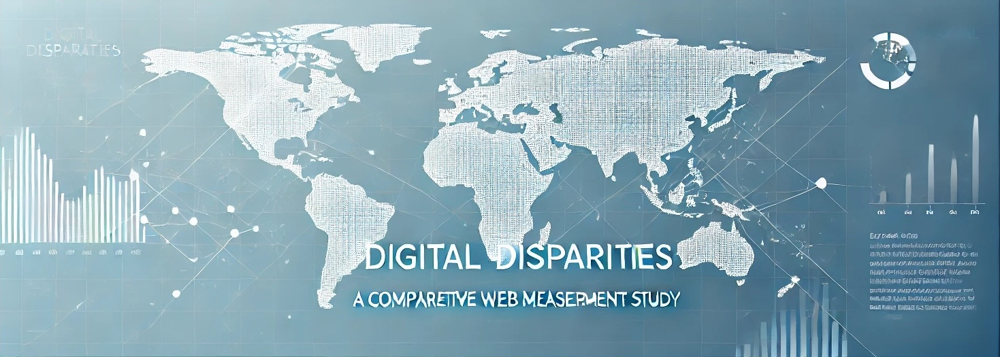

# Digital Disparities: A Comparative Web Measurement Study

This repository contains the dataset, tools, and analysis for our research paper **"Digital Disparities: A Comparative Web Measurement Study Across Economic Boundaries"**, presented at WWW'25. The study explores differences in web development practices across developed and developing countries, focusing on web size, complexity, security, privacy, technology adoption, and performance optimization.

---

## 📄 **Abstract**
While internet usage continues to grow globally, significant disparities persist in how websites are developed and optimized across developed and developing nations. This study presents a comprehensive web measurement analysis of 200,000 popular webpages from 20 countries, providing insights into how the web experience varies due to economic contexts. Key findings include differences in web performance, security practices, technology adoption, and optimization.

---

## 🌍 **Dataset Overview**
- **Size:** 200,000 webpages.
- **Countries Analyzed:**
  - **Developed Countries (10):**
    - United States
    - Japan
    - Germany
    - France
    - United Kingdom
    - Italy
    - South Korea
    - Spain
    - Canada
    - Australia
  - **Developing Countries (10):**
    - China
    - India
    - Indonesia
    - Pakistan
    - Brazil
    - Nigeria
    - Bangladesh
    - Russia
    - Mexico
    - Philippines
- **Source:** Data collected using Google's CrUX, Google Lighthouse, Puppeteer, and IMF's country classifications.
- **Features:**
  - **Performance Metrics:** Webpage size, HTTP requests, image sizes, and unused JavaScript/CSS.
  - **Security Metrics:** HTTPS adoption, CSP usage, vulnerabilities, and outdated libraries.
  - **Privacy Metrics:** Trackers and third-party cookies.
  - **Technology Adoption:** HTTP/2 and HTTP/3 usage, modern web API usage.

---

## 🚀 **Getting Started**

### **Website List**
The `website_list/` folder includes the lists of all 200,000 websites analyzed in this study, with one file per country. Each file contains the top 10,000 websites for that specific country based on Google CrUX and IMF classifications.

### **Usage**
- **Exploration:**
  Use the country-specific files in `website_list/` to explore the top websites analyzed in this study.
- **Data Access:**
  Due to the dataset's size and storage constraints, if you wish to access the full dataset, please contact us via email at **[example_email@domain.com](mailto:example_email@domain.com)**.

---

## 📊 **Results**
Key findings from the analysis include:
1. **Web Performance:** Websites in developing countries are smaller and simpler but often poorly optimized.
2. **Security:** HTTPS adoption is lower in developing regions (88% vs. 95% in developed countries).
3. **Technology:** Developing countries show promising adoption rates for modern protocols like HTTP/2 and HTTP/3.
4. **Privacy:** Websites in developed nations use more trackers and cookies despite stricter regulations.

---

## 🌟 **Contributing**
We welcome contributions to improve the dataset, analysis, or tools. Please submit a pull request or raise an issue.

---

## 📄 **License**
This project is licensed under the [MIT License](LICENSE).

---

## 🖥️ **GitHub Pages**
Explore an interactive dashboard of the dataset and key findings on our [GitHub Pages](https://your_username.github.io/digital-disparities-www25/).

---

## 📝 **Citation**
If you use this dataset or code, please cite:
```
@inproceedings{digital_disparities_www25,
  title={Digital Disparities: A Comparative Web Measurement Study Across Economic Boundaries},
  author={Masudul Hasan Masud Bhuiyan, Matteo Varvello, Cristian-Alexandru Staicu, and Yasir Zak},
  booktitle={Proceedings of the Web Conference (WWW)},
  year={2025},
  publisher={ACM}
}
```
---

For inquiries or access to the full dataset, please email us at **[masudul.bhuiyan@cispa.de](mailto:masudul.bhuiyan@cispa.de)**.
